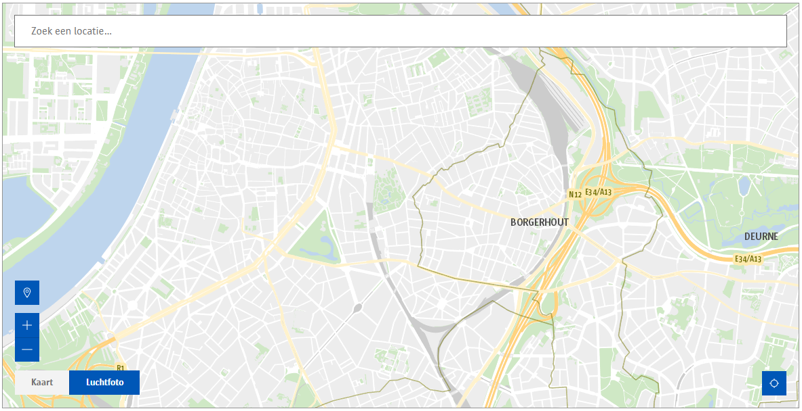
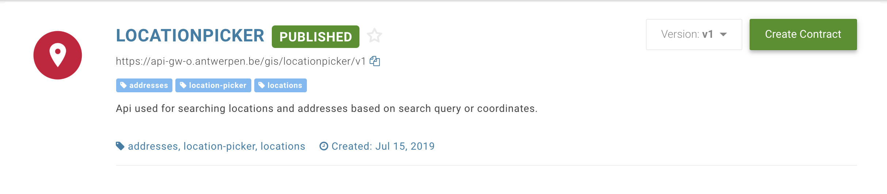

# NgxLocationPicker

Location Picker for Angular 6+. Provides easy to use interface for searching locations or addresses within the city of Antwerp. For projects that are still using Angular 5, we are [maintaining a v1 branch](https://github.com/digipolisantwerp/location-picker_widget_angular/tree/v1), which will still receive bug fixes if needed.

This library was tested in Angular 6, 7 and 8.

##### Desktop view



## Using the component

### Installation

First install the component from npm:

`npm install @acpaas-ui-widgets/ngx-location-picker`

Then import the component inside your module:

```ts
import {LocationPickerModule} from '@acpaas-ui-widgets/ngx-location-picker';

@NgModule({
  imports: [
    ...,
    LocationPickerModule
  ],
  ...
})
```

Finally include the required styles:

Add Antwerp core branding stylesheet in your index.html file:

```html
<link rel="stylesheet" href="https://cdn.antwerpen.be/core_branding_scss/4.0.0/main.min.css">
```

Add required leaflet styles in your angular.json file.

```
"styles": [
    "node_modules/leaflet/dist/leaflet.css",
    "node_modules/leaflet-draw/dist/leaflet.draw.css"
]
```

Next, you will need to configure your BFF to proxy all location picker request to the correct service.
The example below is based on an Express.js powered BFF.
The concept remains the same for different technologies:

The BFF should function solely as a pass-through layer where the API KEY gets added to the request header before proxying.

> We're using axios for handling requests in the example below. Feel free to use any other library.

Step 1: Create a contract with the "LOCATIONPICKER" on the api-store.


Step 2: Copy the api key and api url

Step 3: In your BFF create a .env file and add:
```
API_KEY=00000000-0000-0000-0000-000000000000
LOCATION_PICKER_URL=https://api-gw-o.antwerpen.be/gis/locationpicker/v1
```

Step 4: Create a new file **locations.routes.js** in **/routes** and add the following contents:
```javascript
const express = require('express');
const router = express.Router();
const locationController = require('../controllers/location.controller');

/**
 * Proxy requests from /locations to location picker api.
 */
router.get('/*', locationController.proxyLocationRequest);

module.exports = router;
```

Step 5: Create a new file **locations.controller.js** in **/controllers** and add the following contents:
```javascript
const locationModel = require('../models/location.model');

/**
 * Catch all requests to /locations and proxy to location picker api.
 *
 * @param req {Request}
 * @param res {Response}
 */
exports.proxyLocationRequest = (req, res) => {
    const requestPath = req.originalUrl.replace('/api/v1/locations', '');

    locationModel.handleLocationRequest(requestPath)
        .then((response) => {
            res.status(response.status);
            res.json(response.data);
        })
        .catch((error) => {
            res.status(error.response.status);
            res.json(error.response.data);
        });
};
```

Step 6: Create a new file **locations.model.js** in **/models** and add the following contents:
```javascript
const axios = require('axios');

/**
 * Handle request to location picker api.
 * Add API_KEY to header
 */
exports.handleLocationRequest = (requestPath) => {
    return new Promise((resolve, reject) => {
        // Add our api key (which we added to our .env file) to the request headers
        const requestOptions = {
            headers: {
                'ApiKey': process.env.API_KEY
            }
        };

        axios.get(`${process.env.LOCATION_PICKER_URL}${requestPath}`, requestOptions).then((response) => {
            resolve(response);
        }).catch((error) => {
            reject(error);
        });
    });
};
```

Step 7: Add your newly created route to **app.js**
```javascript
// Add this to the top of app.js
const locationProxy = require('./routes/location.routes');

// Add this after const app = express(); and before any error handler routes
app.use('/api/v1/locations', locationProxy);
```

**That's it!** 🎉

### Usage

Note: There are 3 methods of getting values after selecting a location:

**Method 1: locationSelect event**  
```html
<aui-location-picker
    ...
    (locationSelect)="onLocationSelect($event)"
></aui-location-picker>
```

**Method 2: NgModel**
```html
<aui-location-picker
    ...
    [(ngModel)]="selectedLocation"
></aui-location-picker>
```

**Method 3: Reactive forms**
```html
<aui-location-picker
    ...
    formControlName="selectedLocation"
></aui-location-picker>
```

Method 2 and 3 can also be used to set an initial value:

```ts
selectedLocation = {
    label: 'Generaal Armstrongweg 1, 2020 Antwerpen',
    // Not required but can be useful to show a marker on the map.
    position: {
        lat: 0,
        lng: 0
    }
};
```

**Full example**
```html
<aui-location-picker
    [baseUrl]="baseUrl"
    [defaultZoom]="defaultZoom"
    [onSelectZoom]="onSelectZoom"
    [mapCenter]="mapCenter"
    [hasSidebar]="hasSidebar"
    [showMap]="showMap"
    [featureLayers]="featureLayers"
    [placeholder]="placeholder"
    [label]="label"
    [noResultsLabel]="noResultsLabel"
    (addPolygon)="onAddPolygon($event)"
    (addLine)="onAddLine($event)"
    (editFeature)="onEditFeature($event)"
    (locationSelect)="onLocationSelect($event)"
>

<p>This is shown inside the leaflet sidebar if hasSidebar is set to true.</p>

</aui-location-picker>
```

```ts
class ExampleComponent {

    /* Url to the backend-for-frontend (bff) Should function as pass through to the Location Picker API. */
    @Input() baseUrl;
    /* The default zoom level on map load. */
    @Input() defaultZoom = 14;
    /* The zoom level when a location is selected. */
    @Input() onSelectZoom = 16;
    /* The initial map center on load. */
    @Input() mapCenter: Array<number> = [51.215, 4.425];
    /* Show a sidebar next to the map leaflet. A sidebar can contain any additional info you like. */
    @Input() hasSidebar = false;
    /* Show or hide the map. */
    @Input() showMap = true;
    /* Toggle the clear button */
    @Input() showClearInputButton = true;
    /**
    * Add layers to show on the map. eg: A-card terminals, Velo stations, ...
    * A single featureLayer consists of:
    *
    * url: the url to the mapServer containing the features to be shown on the map.
    * icon: the marker to use to show featureLayer locations.
    *
    * An icon should include: font-awesome icon class, the icon color (default: #0064B) and the icon size (default: 40px)
    * see: FeatureLayerIconModel
    */
    @Input() featureLayers: FeatureLayerModel[] = [];
    /* The input field placeholder text. */
    @Input() placeholder = 'Locaties zoeken...';
    /* Label to use when no results were found. */
    @Input() noResultsLabel = 'Er werden geen locaties gevonden.';
    /* Aria label for clear input button. */
    @Input() clearInputAriaLabel = 'Input veld leegmaken';
    /* Aria label for picking a location on the map */
    @Input() locationPickAriaLabel = 'Kies een locatie op de map';
    /* Aria label for zooming in */
    @Input() zoomInAriaLabel = 'Zoom in';
    /* Aria label for zooming out  */
    @Input() zoomOutAriaLabel = 'Zoom out';
    /* Default tile layer button label */
    @Input() defaultTileLayerLabel = 'Kaart';
    /* Custom leaflet tile layer, if provided, shows actions on the leaflet to toggle between default and custom tile layer. */
    @Input() tileLayer: LeafletTileLayerModel;
    /* Search input length requirement before triggering a search. */
    @Input() minInputLength = 2;
    /* The amount of results to return */
    @Input() locationsLimit = 5;
    /* The layers to search locations for */
    @Input() locationLayers = ['straatnaam'];
    /* Prioritize a layer, boosts results from a given layer to the top of the found locations. */
    @Input() prioritizeLayer = 'straatnaam';
    /* Sort locations by certain key, overrides prioritizeLayer. */
    @Input() sortBy = '';
    /* AddPolygon event */
    @Output() addPolygon = new EventEmitter<any>();
    /* AddLine event */
    @Output() addLine = new EventEmitter<any>();
    /* EditFeature event */
    @Output() editFeature = new EventEmitter<any>();
    /* LocationSelect event: fired when selecting a location. */
    @Output() locationSelect = new EventEmitter<LocationModel | AddressModel | CoordinateModel>();

}
```

## Demo

Live demo can be found on:
https://locationpicker-app1-o.antwerpen.be

You can also choose to test it locally:

In the root directory run:
```
npm install && ng build ngx-location-picker && ng serve
```

This will install all required dependencies, create an optimized build for the location picker library and sets up a local server at http://localhost:4200.

## Local development

Install required dependencies:
```
npm install
```

Rebuild library on changes
```
npm run dev
```

Start example project
```
ng serve
```

Any changes done on the library will visible on http://localhost:4200


## Build

Run `npm run build-lib` to build the project. The build artifacts will be stored in the `dist/` directory and a .tgz file containing the library will be created. This is needed for publishing to NPM.

## Contributing

We welcome your bug reports and pull requests.

Please see our [contribution guide](CONTRIBUTING.md).

## Publishing

> Only the ACPaaS UI team publishes new packages. [Contact us](https://acpaas-ui.digipolis.be/contact) if you need a new release published.

## Running unit tests

Run `ng test ngx-location-picker` to execute the unit tests via [Karma](https://karma-runner.github.io).

## Further help

To get more help on the Angular CLI use `ng help` or go check out the [Angular CLI README](https://github.com/angular/angular-cli/blob/master/README.md).
